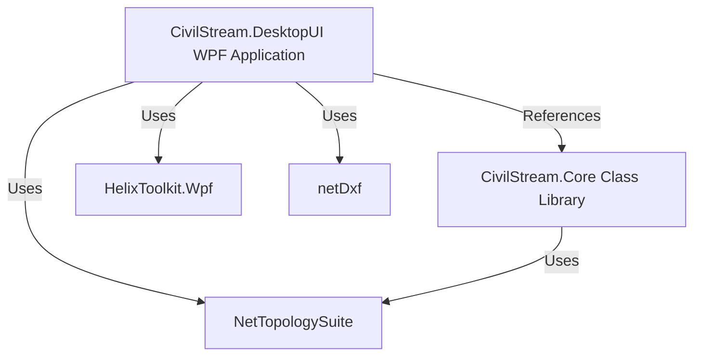

# CivilStreamEngine Technical Analysis & Development Guide

`CivilStreamEngine` is a lightweight, high-performance C# .NET 8.0 WPF desktop application designed for terrain modeling, topographic contour generation, 2D cross-sectional profiling, and OpenBIM/CAD data export.

This document analyzes the codebase, details its features and algorithms, outlines its workflow, and proposes specific development paths for extending it further.

---

## 1. Project Architecture & Components

The solution is divided into two main projects targeting **.NET 8.0**:
1. **`CivilStream.Core`**: A platform-independent class library containing data models, coordinate projections, external elevation services, and parsing logic.
2. **`CivilStream.DesktopUI`**: A WPF desktop client providing the 3D viewport, 2D cross-section viewer, user controls, persistent caching, and CAD/BIM exporters.

### Core Dependencies
* **[HelixToolkit.Wpf](https://github.com/helix-toolkit/helix-toolkit)** (v3.1.2): Manages the 3D scene rendering, viewport navigation (orbit/zoom/pan), lighting, and material shaders.
* **[NetTopologySuite](https://github.com/NetTopologySuite/NetTopologySuite)** (v2.6.0): A port of the JTS Topology Suite. Used for its 2D/3D Delaunay triangulation capabilities and spatial geometric checks.
* **[netDxf](https://github.com/hapl通/netDxf)** (v2023.11.10): An open-source library for reading and writing AutoCAD DXF files.



---
## 2. Technical Breakdown of Features

### A. Data Ingestion & Parsing
* **Delimited Text & CSV**: Handled by [SurveyParser.cs](file:///C:/Users/Abnave_A/Revit2014_Addins/CivilStreamEngine/CivilStream.Core/SurveyParser.cs). It uses a cached separator array `_separators = new[] { ',', '\t', ' ' }` to parse raw lines into coordinates.
* **LandXML**: Reads `.xml` terrain formats by parsing XML nodes targeting `<P>` or `<CgPoint>` values.
* **CAD DXF**: Read via [MainWindow.xaml.cs (ExtractPointsFromDxf)](file:///C:/Users/Abnave_A/Revit2014_Addins/CivilStreamEngine/CivilStream.DesktopUI/MainWindow.xaml.cs). It extracts 3D points from DXF entities, including `Polylines2D`, `Polylines3D`, `Lines`, and `Points`.
  * **Coincident Vertex Snapping**: CAD and DXF meshes frequently contain overlapping or coincident nodes. When passed to Delaunay triangulation, duplicate sites on the $(X, Y)$ plane cause locator loops and crash with a `LocateFailureException`. To prevent this, a spatial hash-grid deduplication filter is applied in `RenderSurveyPoints`. Point coordinates are snapped to cells using a dynamic scale tolerance based on the terrain span:
    $$\text{Tolerance} = \max\left(10^{-4}, \text{maxSpan} \times 10^{-7}\right)$$
    Coincident coordinates are filtered out in $O(N)$ lookup speed, ensuring the triangulation builder always converges.
* **KML Boundary & OpenTopography Ingest**: 
  1. The application parses a geodetic boundary polygon from a `.kml` file.
  2. It queries **OpenTopography's Copernicus GLO-30 Global DEM API** (`https://portal.opentopography.org/API/globaldem`) requesting an ArcASCII Grid (`AAIGrid`) file for the coordinates' bounding box.
  3. The `ParseAsciiGrid` parser translates the grid's cell positions into longitude and latitude, projects them to local meters, and filters them using **NetTopologySuite's native Polygon spatial containment checks** to keep only points inside the user's boundary.
  4. It dynamically downsamples dense grids to target a maximum of **50x50 grid subdivisions (~2,500 points)**, ensuring immediate load times and fluid viewport frame rates.
* **Offline Synthetic Fallback**: If the user has no network connection (DNS resolution failures) or OpenTopography credentials are not provided:
  1. The application prompts to run in **Offline Mode**.
  2. It generates a synthetic, smooth undulating ArcASCII terrain grid (`GenerateMockAsciiGrid`) in-memory.
  3. Rather than fetching satellite imagery, the app generates a high-resolution offline satellite map raster dynamically (`CreateMockSatelliteImage`) utilizing `DrawingVisual` and `RenderTargetBitmap` rendering fields, winding river curves, and highway systems, maintaining a fully detailed terrain mesh with draped imagery.

### B. Distance-Based Laplacian Smoothing
* Satellite digital elevation models (DEMs) are derived from 30m raster grids. Sampling coordinates at fine intervals without smoothing creates boxy, pixelated, stair-stepped meshes.
* To resolve this, the engine runs a **distance-based Laplacian smoothing filter** over the grid points:
  $$Z'_i = (1 - \alpha) Z_i + \alpha \frac{\sum_{j \in \text{Neighbors}} Z_j}{\text{Count of Neighbors}}$$
  where neighboring points are identified dynamically using a Cartesian distance threshold: `dist <= 1.5 * spacing`. Running this filter for 3 iterations smooths out flat plateau steps into natural, rolling slopes.

### C. ArcGIS World Imagery Satellite Draping & Fallback
* Drapes real, high-resolution aerial satellite imagery over the 3D mesh.
* **Imagery Download**: When a KML boundary is loaded, the app queries the free, public **ArcGIS World Imagery Export Service** (`https://services.arcgisonline.com/arcgis/rest/services/World_Imagery/MapServer/export`) with the bounding box, saving the resulting map texture locally.
* **Spatial Texture Coordinates**: Toggling **Satellite Overlay [🛰]** ON dynamically recalculates the mesh's `TextureCoordinates` using spatial coordinates:
  $$U = \frac{X - X_{\text{min}}}{X_{\text{max}} - X_{\text{min}}}$$
  $$V = 1.0 - \frac{Y - Y_{\text{min}}}{Y_{\text{max}} - Y_{\text{min}}}$$
  It compiles the image into a `DiffuseMaterial` and maps it exactly onto the 3D terrain slopes. Toggling it off restores height-based $Z$ mapping for the Heatmap.
* **Offline Fallback Rendering**: If the query fails, a locally generated high-resolution synthetic imagery texture (composed of agricultural fields, a DodgerBlue river curve, and a DimGray highway line) is drawn and draped seamlessly over the coordinates.

### D. Terrain Triangulation & 3D Visualization
* **Coordinate Centering**: Large coordinate systems (e.g., UTM or state plane coordinates) cause floating-point jitter in 3D graphics rendering. The application offsets all incoming points by their bounding box center (`_globalCenterX`, `_globalCenterY`, `_globalBaseZ`) to keep the coordinates small and stable in the viewport, then adds the offset back during cursor display and exports.
* **TIN (Triangulated Irregular Network)**: Points are triangulated into a Delaunay mesh using NetTopologySuite's `DelaunayTriangulationBuilder`.
* **Elevation Heatmap**: Maps texture coordinates `(U, 0.5)` to normalized elevations: `U = Z / Zmax`. A 5-color linear gradient brush (`Blue -> Cyan -> LimeGreen -> Yellow -> Red`) is mapped onto the mesh.
* **Wireframe**: A high-efficiency `LinesVisual3D` displays the edges of all generated triangles.

### E. Vertical Profile Alignment (Multi-Segment Polylines)
* **Polyline Alignments**: Instead of simple two-point straight sections, users can click multiple points to draw **multi-segment polylines** (unlimited Point of Intersections / PI vertices) on the 3D mesh.
  * Real-time red lines represent the path segments. Double-clicking or right-clicking finishes the input.
* **Elevation Interpolation**:
  To calculate the elevation at any sample distance station $S$ along the polyline path, the engine calculates the horizontal coordinate $P(x, y)$ by stepping along the polyline segments. It then finds the containing Delaunay mesh triangle and calculates its plane normal using the cross product of its edges:
  $$\vec{n} = (v_1 - v_0) \times (v_2 - v_0)$$
  Using the plane equation $A(x-x_0) + B(y-y_0) + C(z-z_0) = 0$, it solves for $Z$:
  $$Z = -\frac{A x + B y + D}{C}$$
* **Interactive 2D Chart & Markers**: Renders the continuous cross-section profile on a custom `Canvas` with an adaptive vertical/horizontal grid. 
  * Vertex points are highlighted with orange-red circle markers and dashed vertical lines.
  * Consolas labels overlay above each marker showing: **Vertex ID (e.g. V1, V2)**, **stationing distance (e.g., 205.4m)**, and **terrain elevation (e.g., 94.15m)**.
  * Adaptive panning, mouse-wheel zooming, and zoom-all buttons function smoothly.
* **3D-2D Co-registration & Slider**: A bottom slider lets you scrub through the profile alignment. It renders a yellow sphere tracker in the 3D viewport at the exact coordinates and draws a dashed vertical line tracker with coordinate tooltips on the 2D profile canvas, preserving relative position percentages during edits.
* **Interactive Vertices Tweak Editor**: When a profile is finished, a **📍 PROFILE VERTICES EDITOR** stack panel is shown in the right control sidebar.
  * Each vertex's coordinates ($X, Y$ in real meters) are displayed in editable text boxes.
  * Clickable steppers (`-` and `+`) allow shifting coordinate components by $\pm1.0$ meter incrementally.
  * Editing triggers immediate recalculation of 3D lines, snaps elevations to the underlying TIN mesh, and refreshes the 2D Canvas in real-time.
  * A layout Dispatcher auto-scrolls the sidebar viewport to the bottom (`ScrollToBottom()`) to bring the editor panels into view instantly.

### F. Contour Line Generation
* **Parallel Calculation**: The contour algorithm runs inside `Task.Run` using `Parallel.ForEach` over all local triangles to ensure the UI remains responsive during computation.
* **Edge Intersection Method**: For each triangle, the algorithm checks if a target contour elevation horizontal plane intersects any of the three edges. If the plane intersects exactly two edges, a new contour segment is generated between the intersection points.
* **Interval Classification**: Splits segments into **Major Contours** (heavy white lines at $5\text{m}$ intervals) and **Minor Contours** (thinner gray lines at $1\text{m}$ intervals).

### G. BIM & CAD Export Pipelines
1. **DXF**: Exports contours as native CAD `Line` objects grouped on specialized layers: `C-TOPO-MAJR` (Yellow) and `C-TOPO-MINR` (Dark Gray) using `netDxf`.
2. **LandXML**: Outputs a standard LandXML 1.2 structure featuring a `<Definition surfType="TIN">` containing points (`<Pnts>`) and faces (`<Faces>`), plus contour vectors inside `<PlanFeatures>`.
3. **IFC4**: Writes a custom ASCII-formatted Industry Foundation Classes (IFC4) file. It creates:
   * `IFCSITE` as the spatial container.
   * `IFCTRIANGULATEDFACESET` containing the full 3D terrain mesh.
   * `IFCGEOGRAPHICELEMENT` for both the terrain mesh and the contour curves (`IFCPOLYLINE`).
   * This file can be linked directly into Revit, AutoCAD Civil 3D, or open-source BIM viewers like BIMvision.

---

## 3. Application Usage & Workflow

Here is how you currently operate the application:

```
[Load Survey Data/KML] ──> [Triangulate TIN] ──> [Verify Elevation Heatmap / Satellite Draping]
                                                           │
                                                           ├──> [Draw Polyline Profile Alignment] ──> [Fine-Tune Vertices]
                                                           │
                                                           └──> [Generate Contours] ──> [Export DXF/IFC/LandXML]
```

1. **Importing Terrain Data**: 
   * **CSV / Survey files**: Click the **☁ Load Survey Data** drop-zone and select your file (coincident coordinates snapped automatically).
   * **KML Boundaries**: Input your OpenTopography API Key. Click **Import KML Boundary & Fetch Terrain** and select a `.kml` boundary. Connection failures or missing keys trigger the synthetic offline generator.
2. **Persistent Settings**: Your OpenTopography API Key is automatically stored locally in `opentopography_key.txt` next to the executable and pre-loaded next time you launch the app.
3. **Interacting in 3D (Toggle Buttons with Active Highlights)**:
   * **Toggle Wireframe [▤]**: Active (Blue Highlight) displays triangulation lines. Inactive (Dark Gray) removes them.
   * **Toggle Elevation Heatmap [🌈]**: Active displays the color-mapped gradient. Inactive displays the solid forest-green **Conceptual Shaded View**.
   * **Toggle Satellite Overlay [🛰]**: Active maps and drapes high-resolution aerial imagery (or offline mock map) directly over the terrain surface.
4. **Drawing a Profile Section**: Click the **Ruler (`📏`)** tool. Click vertices on the 3D terrain surface, double-click/right-click to finish. Scrub the slider to track elevation positions.
5. **Fine-Tuning Alignment**: Use the **📍 PROFILE VERTICES EDITOR** in the right control sidebar (scrolled automatically into view) to input coordinates or step values by $\pm1$m.
6. **🔄 Reset Workspace**: Click the red **Reset Workspace** button in the header to clear all loaded data, meshes, contours, cross-sections, and status indicators, restoring the app to a clean idle state.
7. **Exporting Data**: Click the respective buttons in the **Production Exports Hub** to save DXF, IFC4, or LandXML formats.

---

## 4. Ideas for Further Development

Since you are looking to develop this project further, here is a roadmap categorized by target areas:

### 🚀 Roadmap 1: Revit Add-In Integration
The project is stored in a `Revit2014_Addins` directory, suggesting you want to interface with Autodesk Revit.
* **Direct Add-In Wrapper**: Wrap the `CivilStream.Core` parsing and triangulation logic in a Revit External Command (`IExternalCommand`).
* **Direct Topography Creation**: Use Revit API's `TopographySurface.Create` (pre-Revit 2024) or `Toposolid.Create` (Revit 2024+) to convert the parsed CSV/LandXML coordinates directly into native Revit topography elements, bypassing intermediate IFC/DXF files.
* **BIM Mapping**: Dynamically load the generated IFC files directly into Revit using Revit's `CreateLink` or Link IFC API methods.

### 🛣 Roadmap 2: Civil Engineering & Grading Tools
* **Horizontal Curve Alignments**: Upgrade the multi-segment alignment to support vertical and horizontal curves (e.g., circular and spiral curves at PI points) rather than straight polyline segments.
* **Volume Calculations (Cut and Fill)**: Add a tool that calculates the volume difference between two overlapping meshes (e.g., existing ground vs. proposed grading surface) using triangle prisms.
* **Corridor Grading Design**: Enable drawing a road template profile (cross-section width, slope, ditches) and projecting it along a horizontal/vertical path to create a graded corridor surface.

### 🎨 Roadmap 3: Performance & Core Upgrades
* **Spatial Indexing (Octree / R-Tree)**: Currently, finding containing triangles for profile rendering and cursor tracking runs in $O(N)$ linear time. Implementing a 2D Quadtree or R-Tree will speed up this lookup to $O(\log N)$, allowing the application to handle LIDAR files with millions of points smoothly.
* **Re-Triangulation / Mesh Editing**: Allow adding breaklines (lines representing retaining walls, ridges, or ditches that triangles must not cross) and editing coordinates interactively on the viewport.
* **Modern Cross-Platform UI**: Migrate the UI from WPF to **Avalonia UI** or **WinUI 3 (Windows App SDK)** to achieve a modern Fluent design and cross-platform compatibility (macOS/Linux).
