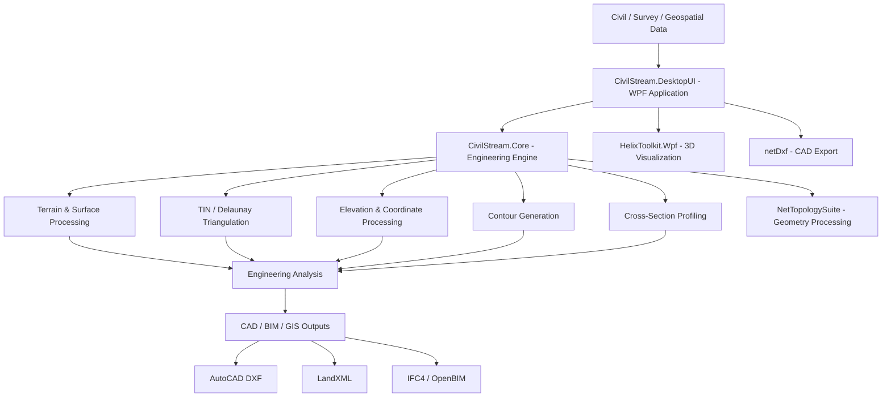

# CivilStream Engine 🌊🏔️

> **A high-performance C#/.NET 8 WPF desktop application for civil engineering terrain modeling, topographic analysis, cross-sectional profiling, and OpenBIM/CAD workflows.**

CivilStream Engine is being developed as a modern engineering platform for processing civil and terrain data and transforming it into practical visualization, analysis, and BIM/CAD workflows.

[](https://dotnet.microsoft.com/)
[](https://learn.microsoft.com/dotnet/csharp/)
[](https://www.microsoft.com/windows/)
[](https://learn.microsoft.com/dotnet/desktop/wpf/)
[](LICENSE)

---

## 🚀 Key Capabilities

- 🌍 Terrain and surface data processing
- 📐 Topographic contour generation
- 📊 2D cross-sectional profiling
- 📁 CSV, TXT, XML, KML and KMZ data processing
- 🏗️ Civil/AEC engineering workflows
- 🔄 OpenBIM/CAD data exchange
- 🖥️ Windows desktop application
- ⚡ C# / .NET 8 / WPF architecture

## 🏗️ Project Vision

CivilStream Engine is the computational foundation for the **Civil View** desktop application.

**CivilStream Engine**  
↓  
Engineering Data & Processing  
↓  
**Civil View**  
↓  
Visualization & Analysis

The long-term goal is to develop intelligent tools that connect traditional civil engineering workflows with **BIM, OpenBIM, GIS, automation, and AI-assisted engineering workflows**.
---

## 🌟 Key Features

* **3D Terrain Triangulation (TIN)**: Converts sparse or dense 3D point clouds into high-precision Delaunay meshes powered by *NetTopologySuite*.
* **Distance-Based Laplacian Smoothing**: Eliminates stair-stepped DEM raster artifacts by running a custom distance-weighted Laplacian filter over 3D elevation grids.
* **ArcGIS & Satellite Overlay Draping**: Fetches global DEM elevation grids via OpenTopography GLO-30 and drapes real-time satellite aerial imagery (ArcGIS World Imagery Service) or high-detail synthetic raster textures onto 3D slopes.
* **Multi-Segment Polyline Profiling**: Interactive 2D cross-sectional profile viewer supporting unlimited polyline vertices, real-time height interpolation on Delaunay triangles, 3D-2D scrub slider co-registration, and live coordinate tweak steppers ($\pm1.0\text{m}$).
* **Parallel Contour Line Computation**: Multi-threaded contour line generator producing major ($5\text{m}$) and minor ($1\text{m}$) elevation contours seamlessly.
* **OpenBIM & CAD Data Exporters**: Native multi-format export pipeline:
  * **AutoCAD DXF** (`netDxf`) with structured layers (`C-TOPO-MAJR`, `C-TOPO-MINR`).
  * **LandXML 1.2** TIN definitions and contour plan features.
  * **IFC4 (Industry Foundation Classes)** 3D `IFCTRIANGULATEDFACESET` terrain & `IFCPOLYLINE` geographic elements.

---

## 📐 Architecture & Technology Stack

CivilStream Engine uses a modular architecture that separates the WPF user interface, engineering computation, terrain processing, 3D visualization, and CAD/BIM export layers.



### Technology Stack

| Component | Technology | Purpose |
| :--- | :--- | :--- |
| **Core Framework** | .NET 8 | Application framework and runtime |
| **Programming Language** | C# 12 | Engineering and application development |
| **User Interface** | WPF | Windows desktop application interface |
| **3D Visualization** | [HelixToolkit.Wpf](https://github.com/helix-toolkit/helix-toolkit) | 3D terrain visualization |
| **Geometry Processing** | [NetTopologySuite](https://github.com/NetTopologySuite/NetTopologySuite) | Spatial geometry and terrain processing |
| **CAD Export** | [netDxf](https://github.com/haplokuon/netDxf) | AutoCAD DXF generation |
| **Terrain Data** | OpenTopography | Digital elevation model data |
| **Satellite Imagery** | ArcGIS World Imagery | Terrain imagery visualization |
| **BIM / Data Exchange** | IFC / LandXML | Civil and OpenBIM interoperability |
---

## 📁 Repository Structure

```
CivilStreamEngine/
├── CivilStream.Core/             # Class library: parsing, models, projections, APIs
│   ├── CivilPoint.cs
│   ├── CoordinateProjection.cs
│   ├── ElevationService.cs
│   └── SurveyParser.cs
├── CivilStream.DesktopUI/        # WPF Desktop Client: 3D scene, 2D profile canvas, exports
│   ├── App.xaml / App.xaml.cs
│   ├── MainWindow.xaml
│   └── MainWindow.xaml.cs
├── CivilStreamEngine.slnx        # Solution manifest (.NET 8.0)
├── CivilStreamEngineAnalysis.md  # Detailed technical analysis documentation
└── Platform_Comparison_Analysis.md # Performance and engine comparisons
```

---

## 🚀 Getting Started

### Prerequisites

* [Visual Studio 2022 / 2026](https://visualstudio.microsoft.com/) with **.NET Desktop Development Workload** installed, or [.NET 8.0 SDK](https://dotnet.microsoft.com/download/dotnet/8.0).
* Windows 10/11 (64-bit).

### Build & Run via CLI

```bash
# Clone the repository
git clone https://github.com/ajayabnave-ctrl/CivilStream_Engine.git

# Change directory
cd CivilStreamEngine

# Restore dependencies and build solution
dotnet build CivilStreamEngine.slnx

# Run the WPF Desktop UI
dotnet run --project CivilStream.DesktopUI/CivilStream.DesktopUI.csproj
```

---

## 📥 Supported File Formats

### Import
* **CSV / TXT**: Raw point clouds (`X, Y, Z` or `PointID, X, Y, Z`).
* **KML**: Boundary polygons with automatic OpenTopography DEM ingestion.
* **AutoCAD DXF**: 3D polylines, lines, and survey point entities.
* **LandXML**: `<P>` and `<CgPoint>` terrain surface definitions.

### Export
* **AutoCAD DXF** (`.dxf`)
* **LandXML 1.2** (`.xml`)
* **IFC4** (`.ifc`)

---

## 📄 License

This project is licensed under the [MIT License](LICENSE).
